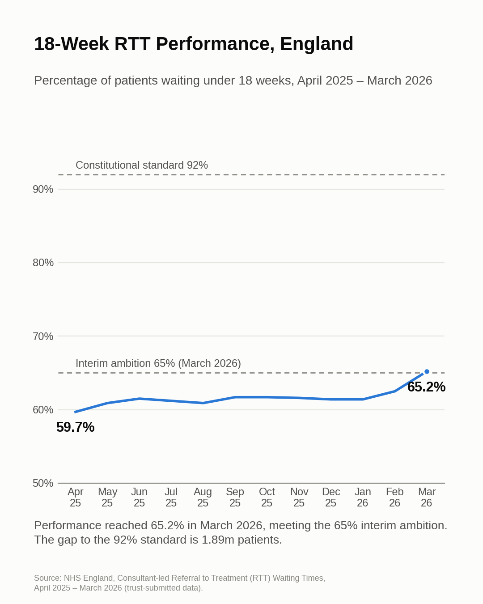
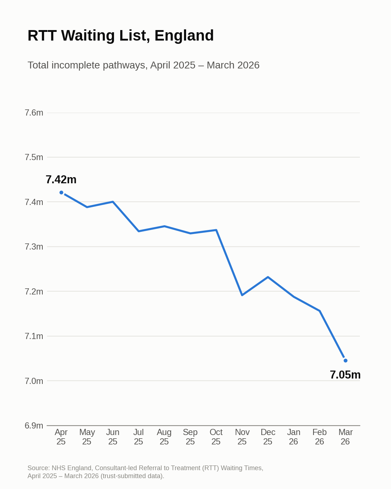
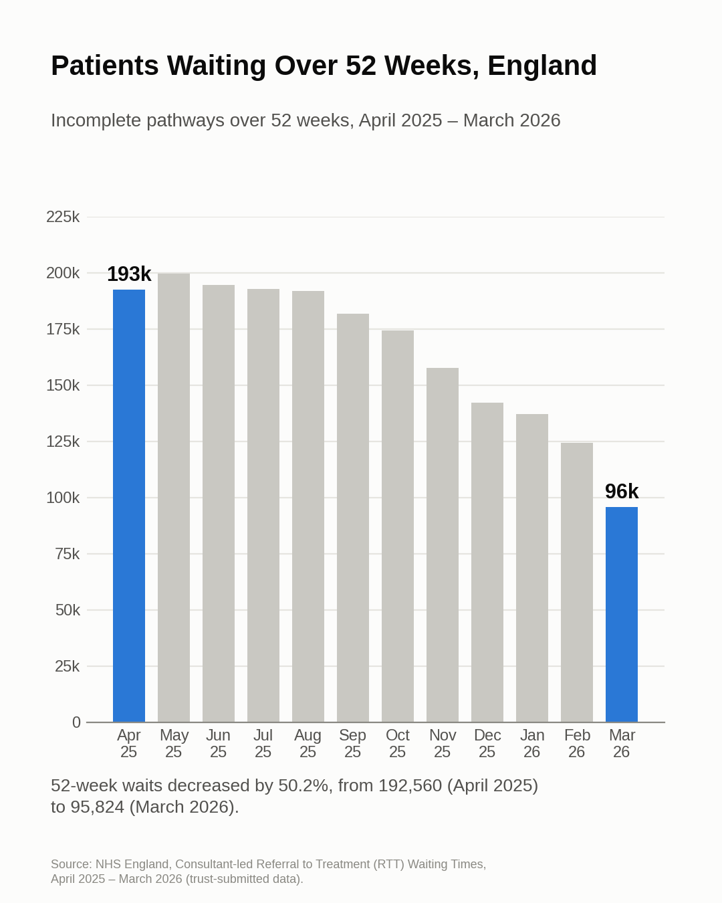
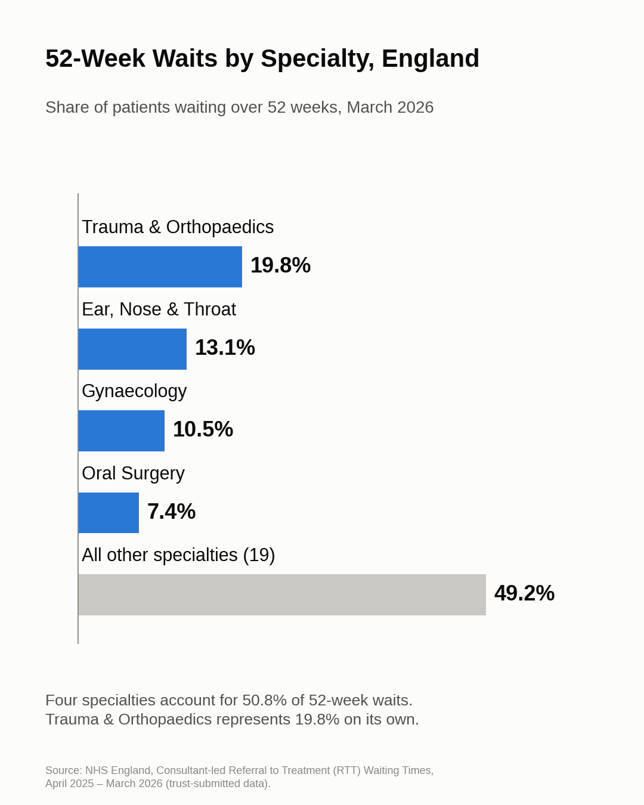
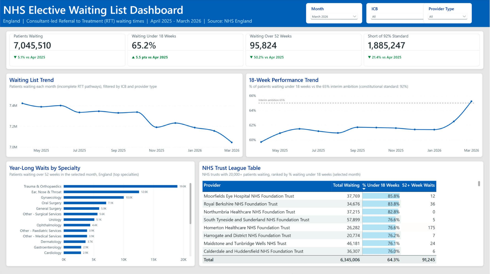

# NHS Elective Waiting List Analysis (England, 2025/26)

**SQL (MySQL) · Excel · Power BI**

An end-to-end analysis of NHS England's referral-to-treatment (RTT) waiting list
across the 2025/26 financial year: 12 monthly extracts, **2.19 million rows**,
loaded into MySQL, modelled as a star schema and analysed against two targets:
the **65% interim ambition for March 2026** and the **92% constitutional standard**
(patients waiting under 18 weeks).



---

## Key findings

1. **Waiting list decreased by 5.1%.** It fell from **7.42m** (April 2025) to
   **7.05m** (March 2026): 376,000 fewer patients (−5.1%). The biggest monthly
   falls came in November (−146k) and March (−111k).
2. **The 65% interim ambition was met in March 2026.** The share waiting under
   18 weeks rose from **59.7% to 65.2%**, but it sat around 61–62% for most of the
   year and most of the gain came in February–March. England is still
   **26.8 points below the 92% standard**, about **1.89m patients short**.
3. **52-week waits halved; 78-week waits increased.** 52+ week waiters fell
   from **192,560 to 95,824 (−50%)**, while 78+ week waiters *rose* from 2,055 to
   2,335 (+14%), indicating that the longest-waiting patients have not benefited
   from the overall improvement.
4. **Four specialties account for half of 52-week waits.** Trauma & Orthopaedics has the
   largest list (**826k**) and **19.8%** of all 52+ week waiters. Together with ENT,
   Gynaecology and Oral Surgery it accounts for **50.8%**.
5. **Performance varies significantly by area.** Across Integrated Care Boards, performance ranges from
   **74.6%** (Gloucestershire) to **51.8%** (Mid and South Essex). Among large NHS
   trusts (20,000+ waiting), Moorfields Eye Hospital leads at **85.8%**, while
   Mid and South Essex NHS FT is lowest at **50.6%** and alone holds **12,150**
   year-long waiters (**12.7%** of England's total).
6. **Independent-sector providers distort unadjusted league tables.** The top of the provider rankings is dominated by
   independent-sector providers (74.1% within 18 weeks vs 64.6% for NHS trusts),
   but they hold only **6.3%** of the list and typically less complex, planned
   cases. NHS trusts are therefore benchmarked separately.

| | | |
|---|---|---|
|  |  |  |

## Power BI dashboard



[`powerbi/nhs_rtt_dashboard.pbix`](powerbi/nhs_rtt_dashboard.pbix) is built on the three
CSV exports from the SQL views. It shows the March 2026 headline KPIs, the monthly
waiting list and 18-week trends (with the 65% interim ambition marked), 52+ week
waits by specialty, and an 18-week league table of NHS trusts with 20,000+ patients
waiting. Measures are documented in [docs/POWERBI_GUIDE.md](docs/POWERBI_GUIDE.md).

## Business questions

1. How did the size of the waiting list change month by month?
2. How far is England from the 65% ambition and the 92% standard?
3. Which specialties have the largest waiting lists and the most long waits?
4. Which providers perform best and worst against the 18-week standard?
5. How does performance vary by Integrated Care Board?
6. Which providers improved or declined the most over the year?
7. Which specialties account for the most 52+ week waits?
8. How do NHS trusts compare with independent-sector providers?

## Data

- **Source:** [NHS England, Consultant-led RTT Waiting Times 2025-26](https://www.england.nhs.uk/statistics/statistical-work-areas/rtt-waiting-times/rtt-data-2025-26/)
- **Files:** 12 monthly "Full CSV data file" extracts, April 2025 – March 2026
  (revised versions where published)
- **Size:** 2,194,667 rows × 121 columns
- **Grain:** provider × commissioner × RTT part × specialty × month, with 105
  weekly waiting-time bands
- Raw files are not in this repo (size). See [docs/SETUP.md](docs/SETUP.md) to download them.

## Approach

```
NHS CSVs (12 months, 2.19m rows)
      │  LOAD DATA: 105 weekly bands summed into 5 wait buckets on load
      ▼
stg_rtt (staging)
      │  profile → filter to the waiting list (Part_2) → remove subtotal rows (C_999)
      ▼
Star schema:  fact_waiting_list (43k rows) + dim_month, dim_provider, dim_specialty
      │  reconciliation: specialty totals match the published totals exactly (0 mismatches)
      ▼
Analysis views  →  SQL answers (Q1–Q8)  →  Excel KPI workbook  →  Power BI dashboard
```

**A data-quality issue found during profiling:** for waiting-list rows (Part_2),
NHS England leaves the "Total" column blank and fills only "Total All". A naive
check reported over a million mismatches. The fix was to validate the buckets
against "Total All" and derive the known-clock-start count from the buckets.

**Metric definitions** (matching NHS England):

| Metric | Definition |
|---|---|
| Waiting list | Incomplete RTT pathways (Part_2), all patients |
| % within 18 weeks | Patients waiting ≤ 18 weeks ÷ patients with a known clock start |
| 52+ week waiters | Patients waiting more than 52 weeks |
| Provider type | "NHS trust" if the organisation name contains "NHS", otherwise independent sector / other |

## Repository structure

```
sql/
  01_create_schema.sql     database + staging table
  02_load_data.sql         loads 12 monthly CSVs, buckets the weekly bands
  03_clean_transform.sql   profiling, star schema, reconciliation checks
  04_analysis.sql          views + 8 business questions (CTEs, window functions)
excel/
  nhs_rtt_summary.xlsx     KPI summary, monthly trend, specialties, NHS trust league table
exports/                   aggregated CSVs from the SQL views (feed Excel and Power BI)
images/                    charts used in this README
powerbi/                   Power BI dashboard (.pbix)
docs/
  SETUP.md                 how to download the data and reproduce everything
  POWERBI_GUIDE.md         dashboard build steps and DAX measures
```

## Limitations

- Monthly snapshots: individual patients aren't tracked between months.
- Figures cover trust-submitted data only. NHS England's headline totals add
  estimates for trusts that didn't submit, so they can be slightly higher.
- Provider type is inferred from organisation names.
- Buckets are summed at load, so median and 92nd-percentile waits aren't calculated.

## Next steps

- Keep the weekly bands to estimate median and 92nd-percentile waits.
- Forecast the waiting list and 18-week performance for 2026/27.
- Add referral demand (new RTT periods, Part_3) to separate demand from capacity.

## Author

**Jayesh Patil** · Data Analyst · MSc Business Analytics (Northumbria University)
[LinkedIn](https://www.linkedin.com/in/jayesh--p/)
